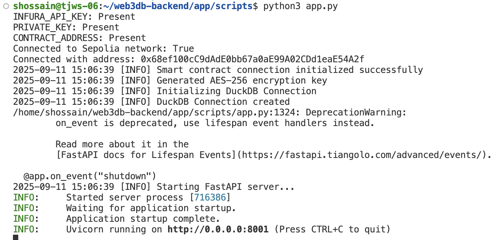

# Web3DB Backend Setup Instructions

## Running the System Without SGX

Follow these steps to set up and run the MtDB backend application in a standard (non-SGX) environment:

### Prerequisites
- Python 3.x installed on your system
- Administrative privileges for package installation

### Installation and Setup

1. **Clone the repo and navigate to the application directory:**
    ```bash
    git clone https://github.com/nd-dsp-lab/web3db-backend
    cd web3db-backend/app
    ```

2. **Install Python dependencies:**
   ```bash
   sudo pip3 install -r requirements.txt --break-system-packages
   ```

3. **Navigate to the scripts directory:**
   ```bash
   cd scripts
   ```

4. **Start the application:**
   ```bash
   python3 app.py
   ```

### Verification

Once the application starts successfully, you should see output similar to the following:



### Accessing the API Documentation

The application provides an interactive API documentation interface via Swagger UI. You can access it at:

**URL:** http://host-ip:8000/docs#


### Notes
- Ensure all dependencies are properly installed before running the application
- The application will be accessible on the specified port once started
- Use the Swagger UI to explore and test the available API endpoints

### Additional Resource
**[SGX Setup Instructions](README.md)** - Detailed setup guide for running MtDB node inside gramine/sgx