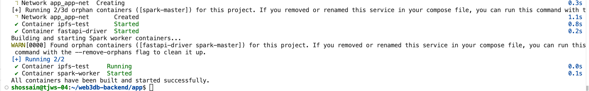
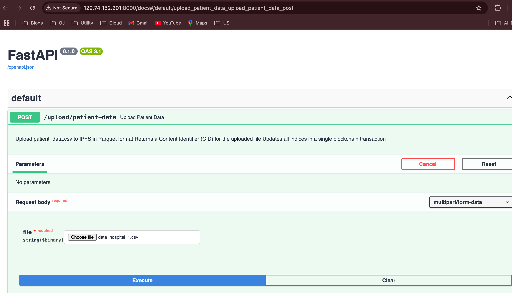
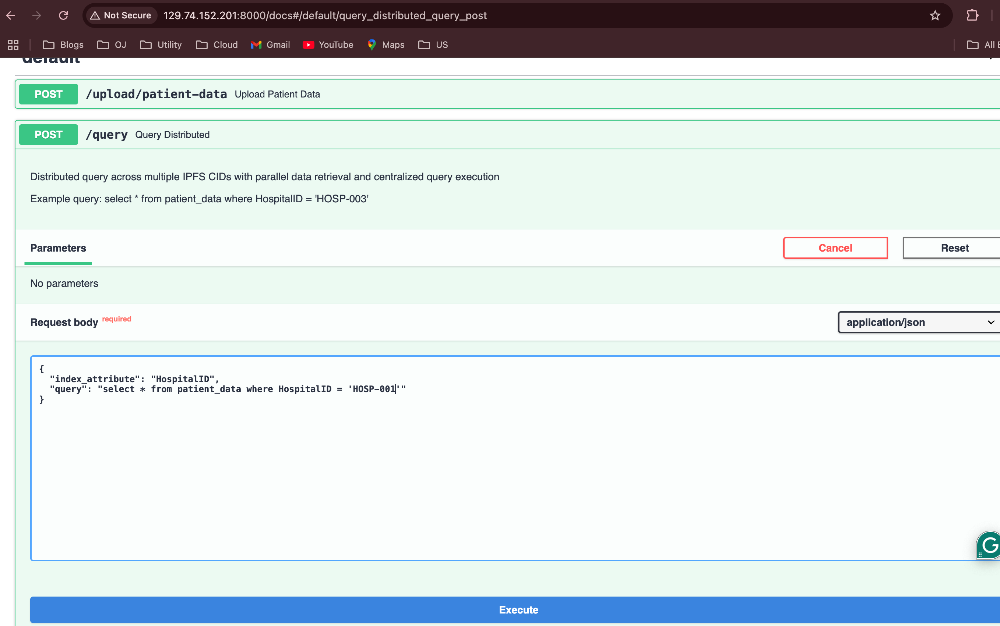

# Web3DB Node Setup Guide

## Prerequisites

- Linux OS
- Docker and Docker Compose
- Metamask Wallet

## Installation Steps

### 1. Clone the Repository

```bash
git clone https://github.com/nd-dsp-lab/web3db-backend
cd web3db-backend
git checkout feature/healthcare_prototype
cd app
```

### 2. Configuration

Edit the `.env` file and update the following configurations:

#### Spark Master Configuration

```
SPARK_MASTER_HOST=<your-host-ip>
SPARK_DRIVER_HOST=<your-host-ip>
SPARK_PUBLIC_DNS=<your-host-ip>
SPARK_LOCAL_IP=<your-host-ip>
SPARK_MASTER=spark://<your-host-ip>:7077
```

#### Web3 Configuration

```
PRIVATE_KEY=<your-metamask-private-key>
```

> **Note**: Replace `<your-host-ip>` with your actual host IP address and `<your-metamask-private-key>` with your Metamask wallet's private key.

### 3. Start the Node

```bash
./start.sh
```

Upon successful deployment, you'll see output similar to the following.


## Verification

Congratulations! You've successfully deployed your Web3DB node. Verify your deployment using:

### Web Interfaces

- WebUI: http://your-host-ip:8000/docs#/
- Spark Master UI: http://your-host-ip:8080/

### Docker Containers

Check running containers:

```bash
sudo docker ps
```

You should see 4 containers running:

- spark-master
- fastapi-driver
- ipfs
- spark-worker

### 4. Upload Data
Go to the WebUI to upload sample patient data. We have data samples in app/dataset directory for few hospitals. Suppose, your node is representing Hospital 1. So you upload data_hospital_1.csv. This will upload data to public ipfs and update the index in smart contract so that any web3db node can access your data. Right now we don't have any access control. So any node will be able to query your data.


### 5. Query Data
Go to the /query API as shown below. Run the following query to check your data. You can query other hospital (e.g., HOSP-003) data too.
```sql
{
  "index_attribute": "HospitalID",
  "query": "select * from patient_data where HospitalID = 'HOSP-001'"
}
```

## Scaling Workers

By default, your deployment includes 1 spark worker. You can add additional workers to your cluster.

### Adding Workers

Workers can be co-located on the same host or distributed across different hosts within the same network.

```bash
sudo docker compose -f worker.yml up -d
```

This deploys an additional spark worker with a co-located IPFS node.

### Verifying Worker Addition

- Check the Spark Master UI: http://your-host-ip:8080/
- View worker logs: `sudo docker logs spark-worker`

## Shutting Down

### Stop a Worker

```bash
sudo docker compose -f worker.yml down
```

### Stop the Entire Node

```bash
./stop.sh
```

## Website

- [Web3DB](https://docs.web3db.org)

If you face any issue or want to contribute, please feel to contact us!
