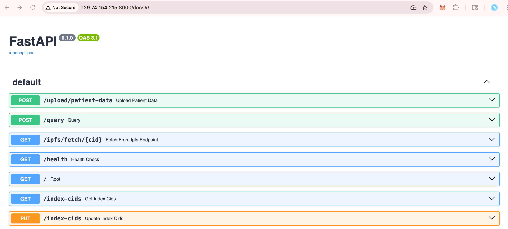

# MtDB: A Decentralized Multi-Tenant Database for Secure Data Sharing

This repository contains the implementation and evaluation code for our research article: **"MtDB: A Decentralized Multi-Tenant Database for Secure Data Sharing"**.

### Key Features

- **Intel SGX v2**: Confidential computing and privacy-preserving query processing
- **IPFS Integration**: Distributed storage with content-addressable data
- **Blockchain (Ethereum)**: Metadata management and index integrity
- **Advanced Indexing**: Delta-based updates for efficient querying
- **Query Re-writer**: In-enclave fine-grained access control enforcement

> **Note**: For detailed technical information, please refer to our research paper.

## High Level System Architecture

```
┌─────────────────┐    ┌─────────────────┐    ┌─────────────────┐
│   Client App    │    │  SGX Enclave    │    │   Blockchain    │
│                 │───▶│                 │───▶│                 │
│ Query Interface │    │ Query Processor │    │ Index Metadata  │
└─────────────────┘    └─────────────────┘    └─────────────────┘
         │                       │                       │
         └───────────────────────┼───────────────────────┘
                                 │
                    ┌─────────────────┐
                    │      IPFS       │
                    │                 │
                    │ Encrypted Data  │
                    │   Partitions    │
                    └─────────────────┘
```

## Prerequisites

Before installing MtDB, ensure your system meets the following requirements:

| Requirement | Version/Details |
|-------------|----------------|
| **Operating System** | Ubuntu 20.04/22.04 LTS |
| **Intel SGX v2** | Hardware support with SGX driver installed |
| **Gramine** | SGX runtime environment |
| **Python** | 3.8 or higher |
| **IPFS** | Local IPFS node |
| **Docker** | Latest stable version |

## Deploy/Run MtDB Node

### 1. Clone the Repository

```bash
git clone https://github.com/nd-dsp-lab/web3db-backend
cd web3db-backend/app
```

### 2. Install Python Dependencies

```bash
sudo pip3 install -r requirements.txt --break-system-packages
```

### 3. Build the SGX Application

**For SGX-enabled variant:**
```bash
sudo make clean
sudo make SGX=1
```

**For vanilla variant (optional):**
```bash
sudo make
```

Upon successful build, you should see output similar to:

```console
shossain@tjws-06:~/web3db-backend/app$ sudo make SGX=1
gramine-manifest \
        -Dlog_level=error \
        -Darch_libdir=/lib/x86_64-linux-gnu \
        -Dentrypoint=/usr/bin/python3.12 \
        -Dra_type=dcap \
        python.manifest.template >python.manifest
gramine-sgx-sign \
        --manifest python.manifest \
        --output python.manifest.sgx

Attributes (required for enclave measurement):
    size:        0x200000000
    edmm:        True
    max_threads: 1

SGX remote attestation:
    None

Memory:
    00000001ffe75000-0000000200000000 [REG:R--] (manifest) measured
    00000001ffe6d000-00000001ffe75000 [REG:RW-] (ssa) measured
    00000001ffe6c000-00000001ffe6d000 [TCS:---] (tcs) measured
    00000001ffe6b000-00000001ffe6c000 [REG:RW-] (tls) measured
    00000001ffe2b000-00000001ffe6b000 [REG:RW-] (stack) measured
    00000001ffe1b000-00000001ffe2b000 [REG:RW-] (sig_stack) measured
    00000001ffdc3000-00000001ffe12000 [REG:R-X] (code) measured
    00000001ffe12000-00000001ffe1b000 [REG:RW-] (data) measured

Measurement:
    637e53fc5abc75eef609cfc0572ea617cde8a57b34e7528a160c9377ea9642bf
```

### 4. Setup IPFS Node

If IPFS is not already running on your system:

```bash
cd ipfs
sudo docker-compose up -d
cd ..
```

### 5. Launch the Application

#### Option A: SGX-Enabled Mode (Recommended)

```bash
sudo gramine-sgx ./python scripts/app.py
```

Upon successful startup, you should see:

```console
shossain@tjws-06:~/web3db-backend/app$ sudo gramine-sgx ./python scripts/app.py
Gramine is starting. Parsing TOML manifest file, this may take some time...
-----------------------------------------------------------------------------------------------------------------------
Gramine detected the following insecure configurations:

  - loader.insecure__use_cmdline_argv = true   (forwarding command-line args from untrusted host to the app)
  - sys.insecure__allow_eventfd = true         (host-based eventfd is enabled)
  - sgx.allowed_files = [ ... ]                (some files are passed through from untrusted host without verification)

Gramine will continue application execution, but this configuration must not be used in production!
-----------------------------------------------------------------------------------------------------------------------

2025-09-11 15:34:28 [INFO] Smart contract connection initialized successfully
2025-09-11 15:34:28 [INFO] Generated AES-256 encryption key
2025-09-11 15:34:28 [INFO] Initializing DuckDB Connection
2025-09-11 15:34:55 [INFO] DuckDB Connection created
//scripts/app.py:1324: DeprecationWarning: 
        on_event is deprecated, use lifespan event handlers instead.

        Read more about it in the
        [FastAPI docs for Lifespan Events](https://fastapi.tiangolo.com/advanced/events/).
        
  @app.on_event("shutdown")
2025-09-11 15:35:06 [INFO] Starting FastAPI server...
INFO:     Started server process [1]
INFO:     Waiting for application startup.
INFO:     Application startup complete.
INFO:     Uvicorn running on http://0.0.0.0:8001 (Press CTRL+C to quit)
```

🎉 **Congratulations!** Your SGX-enabled MtDB node is now running!

#### Option B: Vanilla Mode

```bash
sudo gramine-direct ./python scripts/app.py
```

### 6. Access the API Documentation

The application provides an interactive Swagger UI for API exploration and testing:

**URL:** http://host-ip:8000/docs#



## Documentation

### Additional Resources

- **[Non SGX Setup Instructions](Instructions.md)** - Detailed setup guide for running without gramine/sgx
- **[Smart Contract Documentation](contracts/SMART_CONTRACT.md)** - Blockchain integration details
- **[Access Control Summary](ACCESS_CONTROL_SUMMARY.md)** - Security and access control information

### External Documentation

- [Intel SGX Documentation](https://www.intel.com/content/www/us/en/developer/tools/software-guard-extensions/overview.html)
- [Gramine SGX Runtime](https://gramine.readthedocs.io/)
- [IPFS Documentation](https://docs.ipfs.io/)

## Important Notes

> **Research Prototype**: This is research prototype software. For production deployments, additional security measures, thorough testing, and security audits are strongly recommended.

## Contact

We welcome contributions! For questions, issues, or collaboration opportunities, please contact the research team at [nd-dsp-lab](https://github.com/nd-dsp-lab).