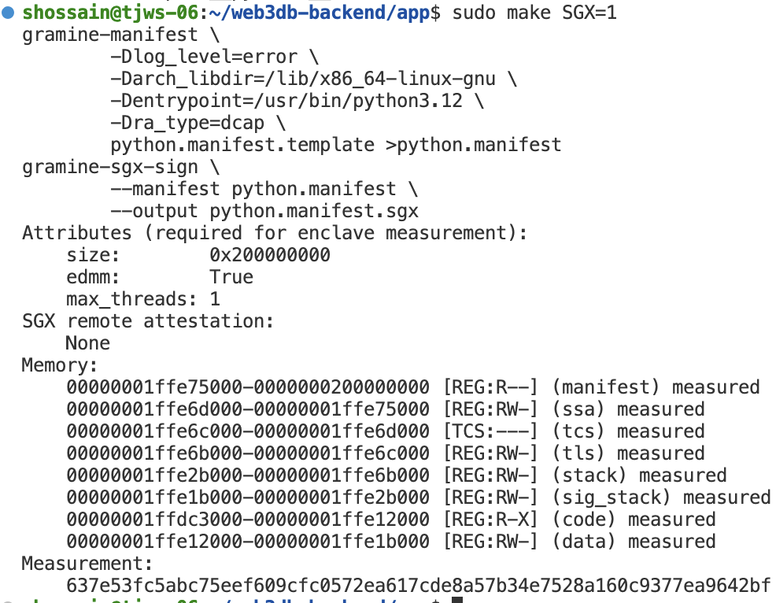
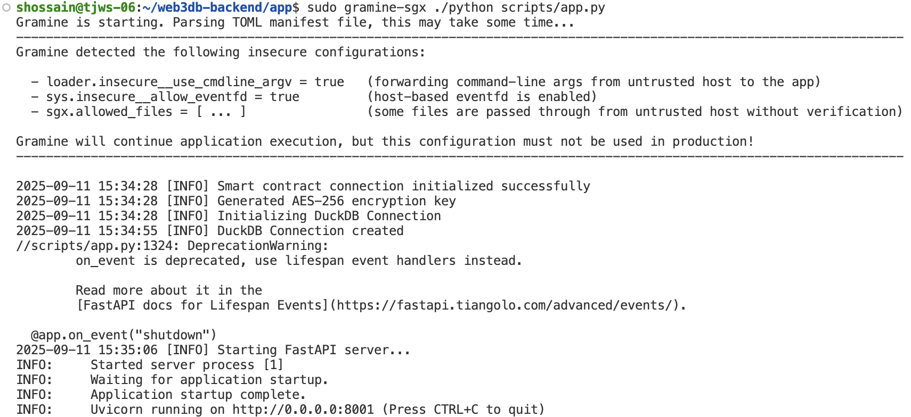

# MtDB: A Decentralized Multi-Tenant Database for Secure Data Sharing

This repository contains the implementation and evaluation code for our research article: **"MtDB: A Decentralized Multi-Tenant Database for Secure Data Sharing"**.

### Key Features

- **Intel SGX v2**: Confidential computing and privacy-preserving query processing
- **IPFS Integration**: Distributed storage with content-addressable data
- **Blockchain (Ethereum)**: Metadata management and index integrity
- **Advanced Indexing**: Delta-based updates for efficient querying
- **Query Re-writer**: In-enclave fine-grained access control enforcement

> **Note**: For detailed technical information, please refer to our research paper.

## High Level System Architecture

```
┌─────────────────┐    ┌─────────────────┐    ┌─────────────────┐
│   Client App    │    │  SGX Enclave    │    │   Blockchain    │
│                 │───▶│                 │───▶│                 │
│ Query Interface │    │ Query Processor │    │ Index Metadata  │
└─────────────────┘    └─────────────────┘    └─────────────────┘
         │                       │                       │
         └───────────────────────┼───────────────────────┘
                                 │
                    ┌─────────────────┐
                    │      IPFS       │
                    │                 │
                    │ Encrypted Data  │
                    │   Partitions    │
                    └─────────────────┘
```

## Prerequisites

Before installing MtDB, ensure your system meets the following requirements:

| Requirement | Version/Details |
|-------------|----------------|
| **Operating System** | Ubuntu 20.04/22.04 LTS |
| **Intel SGX v2** | Hardware support with SGX driver installed |
| **Gramine** | SGX runtime environment |
| **Python** | 3.8 or higher |
| **IPFS** | Local IPFS node |
| **Docker** | Latest stable version |

## Deploy/Run MtDB Node

### 1. Clone the Repository

```bash
git clone https://github.com/nd-dsp-lab/web3db-backend
cd web3db-backend/app
```

### 2. Install Python Dependencies

```bash
sudo pip3 install -r requirements.txt --break-system-packages
```

### 3. Build the SGX Application

**For SGX-enabled variant:**
```bash
sudo make clean
sudo make SGX=1
```

**For vanilla variant (optional):**
```bash
sudo make
```

Upon successful build, you should see output similar to:



### 4. Setup IPFS Node

If IPFS is not already running on your system:

```bash
cd ipfs
sudo docker-compose up -d
cd ..
```

### 5. Launch the Application

#### Option A: SGX-Enabled Mode (Recommended)

```bash
sudo gramine-sgx ./python scripts/app.py
```

Upon successful startup, you should see:



🎉 **Congratulations!** Your SGX-enabled MtDB node is now running!

#### Option B: Vanilla Mode

```bash
sudo gramine-direct ./python scripts/app.py
```

### 6. Access the API Documentation

The application provides an interactive Swagger UI for API exploration and testing:

**🌐 URL:** http://host-ip:8000/docs#


## 📚 Documentation

### Additional Resources

- **[Non SGX Setup Instructions](Instructions.md)** - Detailed setup guide for running without gramine/sgx
- **[Smart Contract Documentation](contracts/SMART_CONTRACT.md)** - Blockchain integration details
- **[Access Control Summary](ACCESS_CONTROL_SUMMARY.md)** - Security and access control information

### External Documentation

- 📖 [Intel SGX Documentation](https://www.intel.com/content/www/us/en/developer/tools/software-guard-extensions/overview.html)
- 🛠️ [Gramine SGX Runtime](https://gramine.readthedocs.io/)
- 🌐 [IPFS Documentation](https://docs.ipfs.io/)

## ⚠️ Important Notes

> **Research Prototype**: This is research prototype software. For production deployments, additional security measures, thorough testing, and security audits are strongly recommended.

## 📧 Contact

We welcome contributions! For questions, issues, or collaboration opportunities, please contact the research team at [nd-dsp-lab](https://github.com/nd-dsp-lab).

---

*Built by the ND DSP Lab team*